# Keypering Manual

## First Launch

  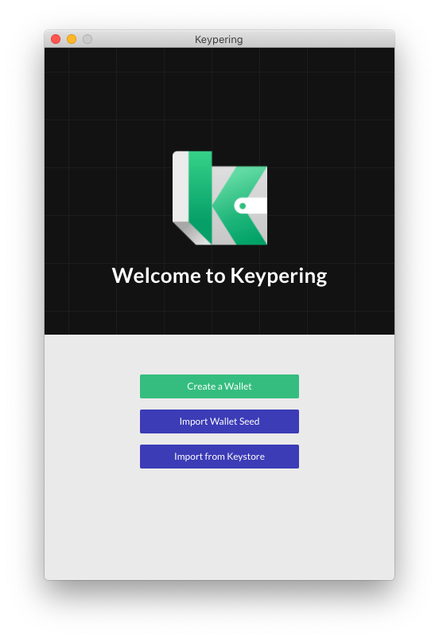

There're three method to create your first wallet

- [Create a Wallet](manual?id=create-a-wallet) Create a wallet by randomly generated mnemonic(seed)
- [Import Wallet Seed](manual?id=import-wallet-seed) Import your own mnemonic(seed) to create a wallet
- [Import from Keystore](manual?id=import-from-keystore) Import your own keystore file

---

### Create a Wallet

There're three steps to create a wallet from scratch

1. Randomly generate a mnemonic(seed)
2. Confirm and backup the mnemonic(seed)
3. Set wallet name and password for new wallet

  <b><small>Genearete mnemonic(seed)</small></b>
  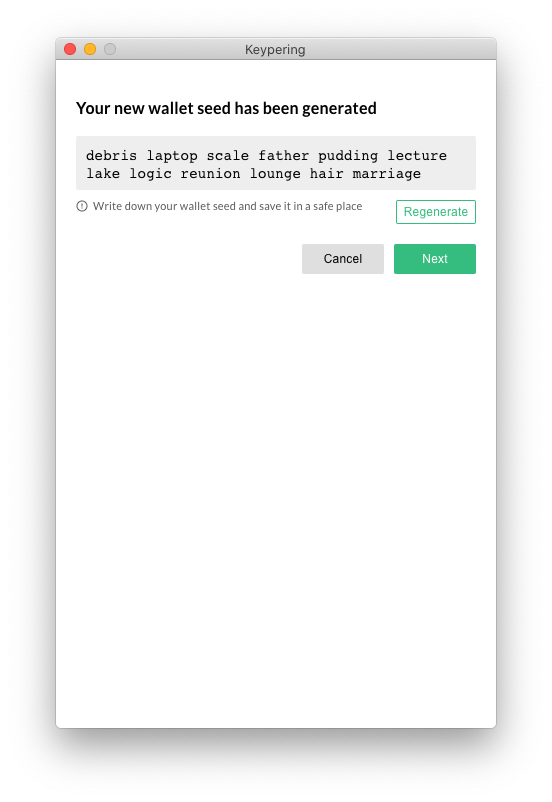

  <b><small>Confirm Mnemonic</small></b>
  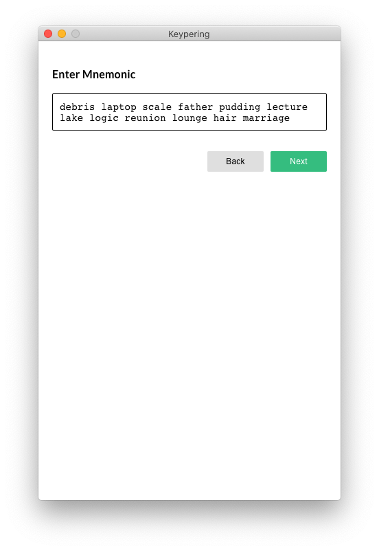

  <b><small>Add Wallet Info</small></b>
  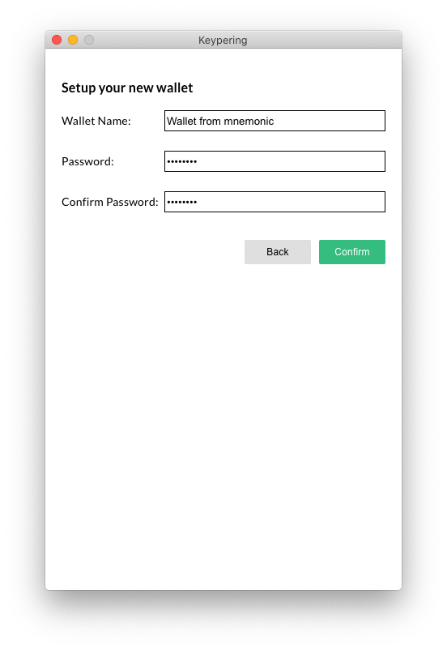

---

### Import Wallet Seed

There're two steps to create a wallet from an existing mnemonic(seed)

1. Input mnemonic(seed)
2. Set wallet name and password for new wallet

  <b><small>Confirm Mnemonic</small></b>
  

  <b><small>Add Wallet Info</small></b>
  

---

### Import from Keystore

Import an existing wallet from a keystore file

**Keypering is not an HD wallet and doesn't have a specific wallet path, which means the wallet exported from [Neuron](https://github.com/nervosnetwork/neuron) cannot be recovered in Keypering theoratically.**

  <b><small>Import Keystore</small></b>
  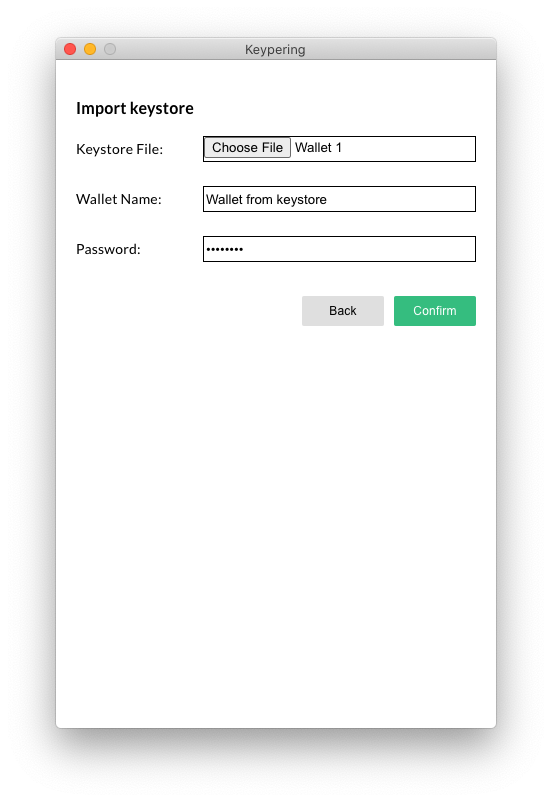

---

## Addresses

Addresses will be speculated from enabled lock scripts in Keypering.

There're two types of balance belong to an adress

- Free - total capacity of cells who has no data and no type script thus they are safe to consume;
- In Use - total capacity of cells who has data or type script and require doublethink to use.

  <b><small>Addresses</small></b>
  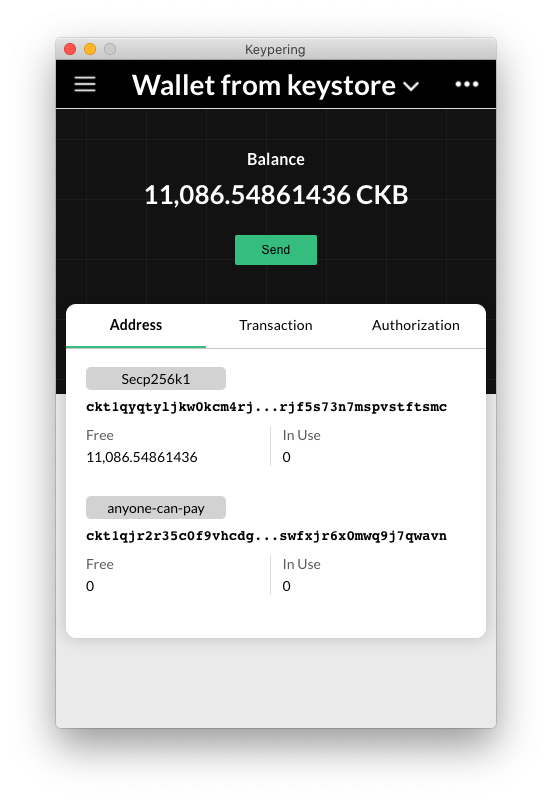

---

## Send Transaction from Keypering

Three're 3 steps to send a transaction from Keypering

1. Specify address and amount to send
2. Check the transaction information
3. Confirm to sign the transaction

<small><b>Tip</b>: Click the right arrow in the Transaction panel to view details on Explorer.</small>

  <b><small>Send Transaction From Keypering</small></b>
  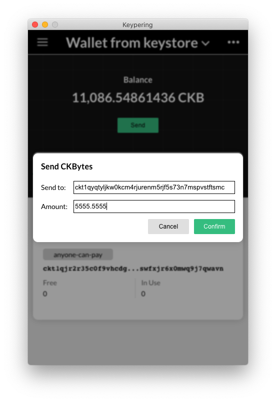

  <b><small>Check Transaction From Keypering</small></b>
  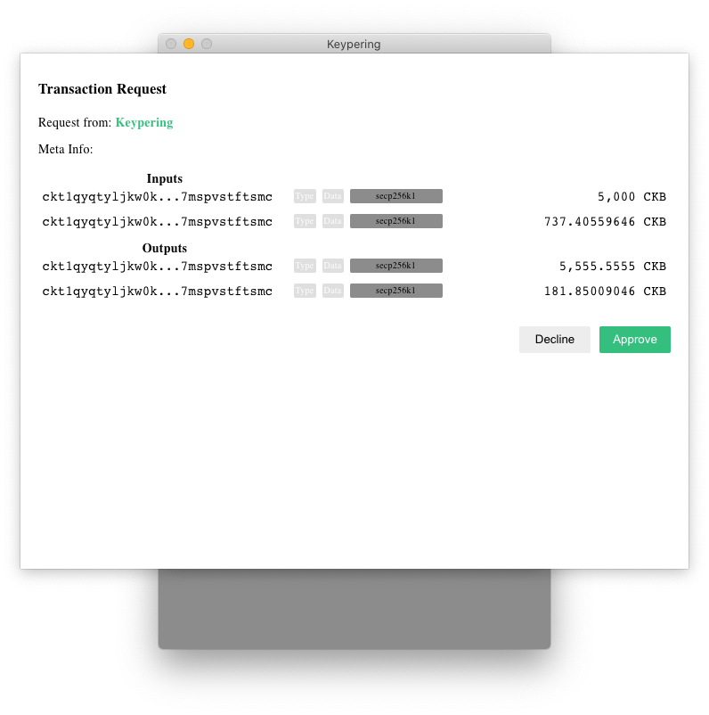

  <b><small>Confirm Transaction From Keypering</small></b>
  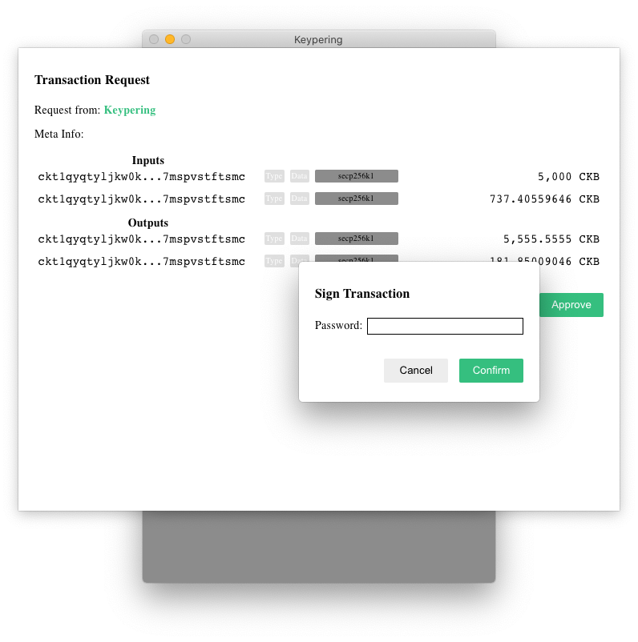

  <b><small>History updated</small></b>
  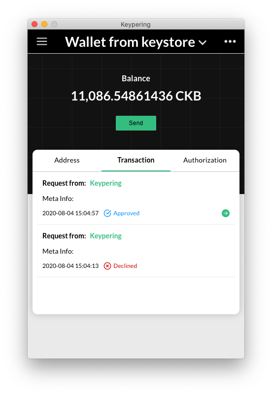

---

## DApp

DApp can send JSON RPC conforming to [Keypering Agency Protocal](/protocol) to interact with Keypering.

### Grant DApp Authorization

  <b><small>Request Auth from DApp</small></b>
  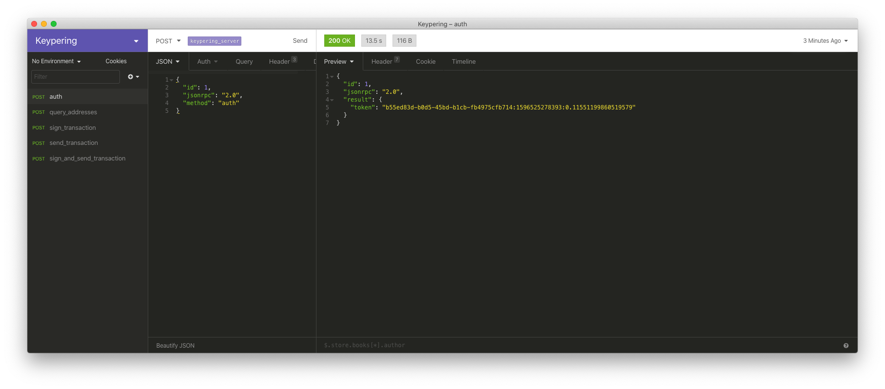

  <b><small>Grant DApp Token</small></b>
  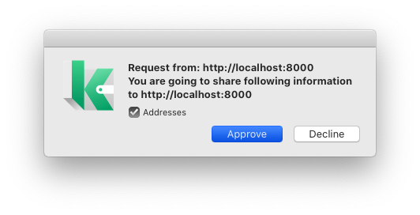

  <b><small>Authorizations</small></b>
  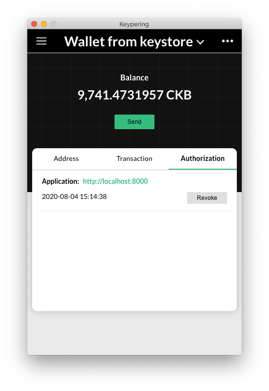

  <b><small>Set Authorization Header</small></b>
  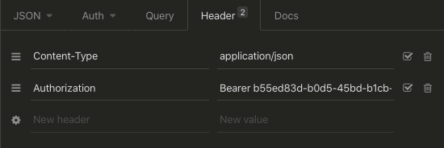

---

### DApp Query Addresses

  <b><small>Query Addresses</small></b>
  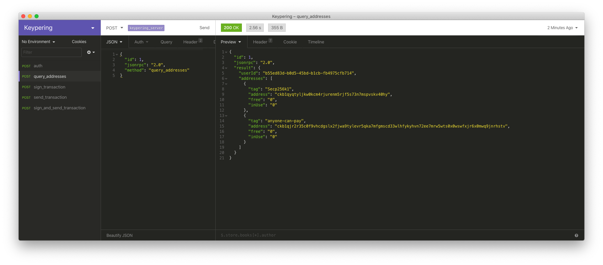

---

### Sign Transaction from DApp

  <b><small>DApp Request Sign Transaction</small></b>
  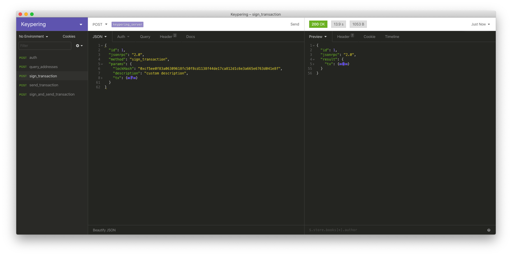

  <b><small>Check Transaction from DApp</small></b>
  

  <b><small>Approved Transaction</small></b>
  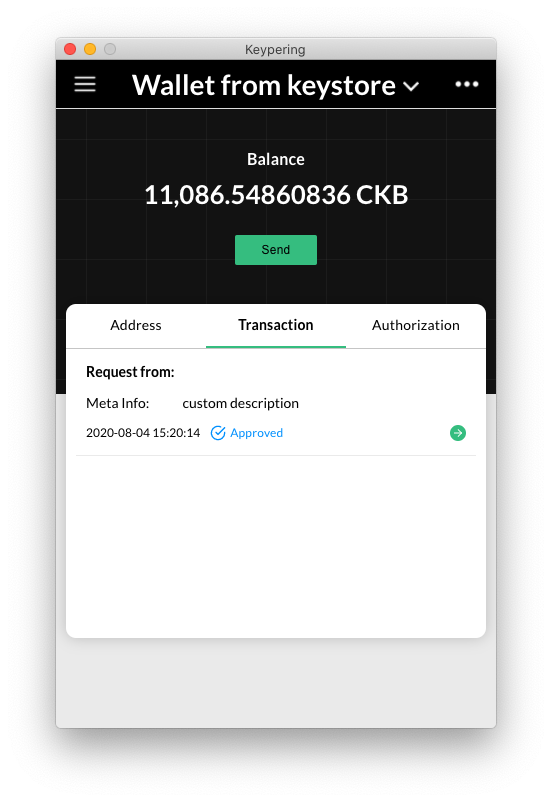

---

### Send Signed Transaction from DApp

  <b><small>Send Signed Transaction from DApp</small></b>
  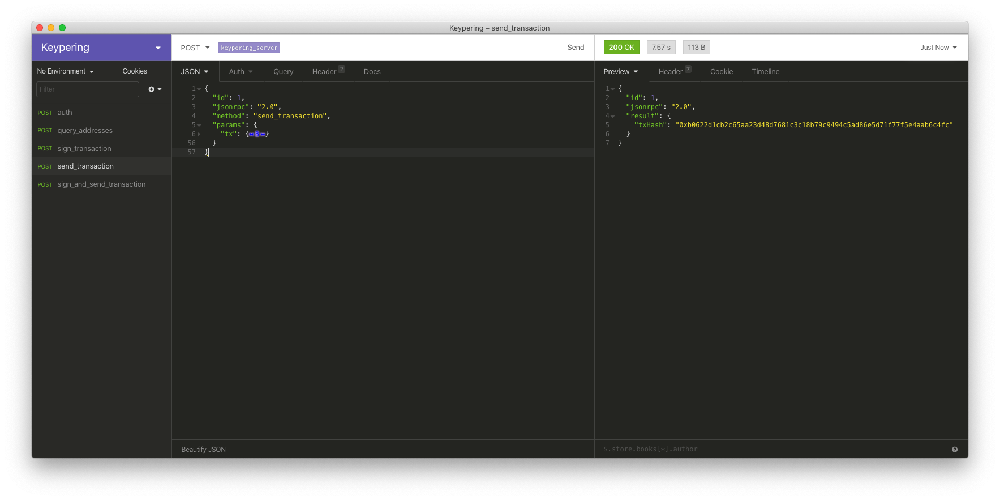

  <b><small>Check Signed Transaction from DApp</small></b>
  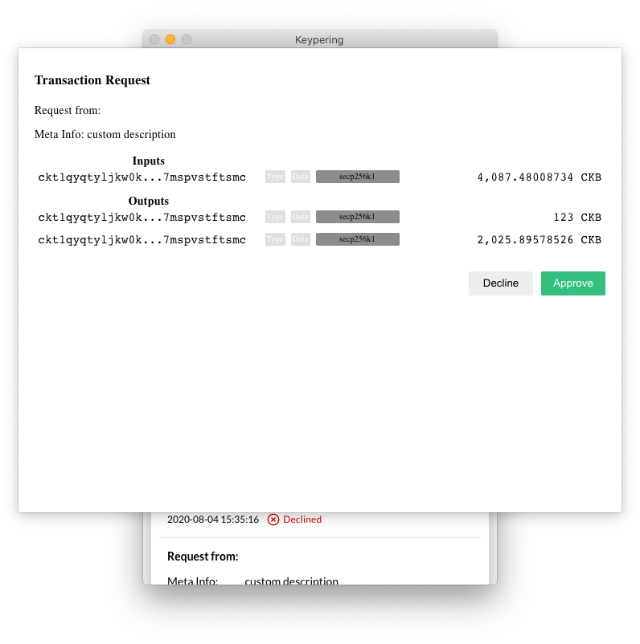

---

### Sign and Send Transaction from DApp

  <b><small>Transaction from DApp</small></b>
  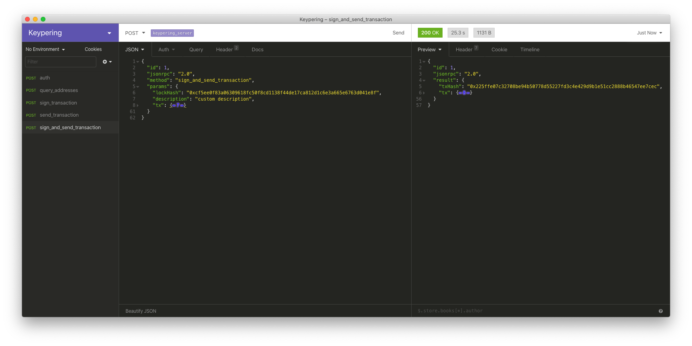

---

## Setting

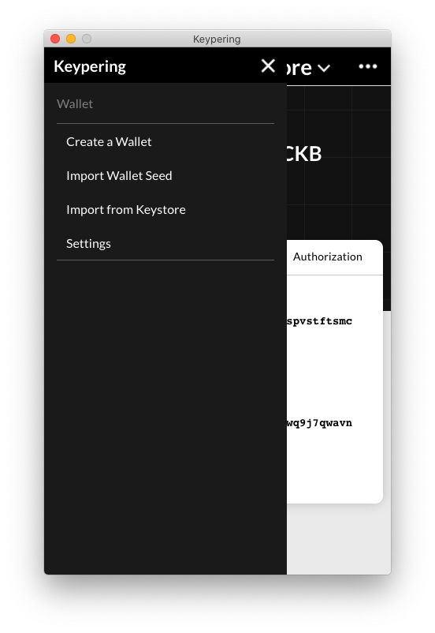
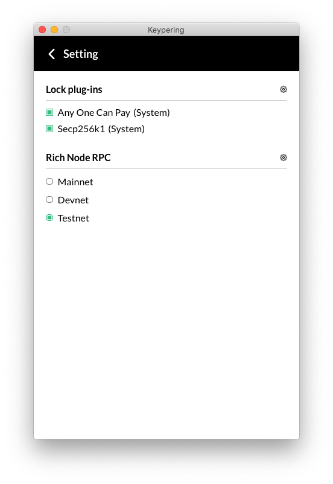

### Lock plug-ins

The lock plug-ins setting is used to specify which lock scripts are used to generate addresses and sign transactions.

Custom lock scripts can be loaded by specifying a directory containing your scripts. After that your scripts will be parsed and whose in right fomrat will be imported.

> Custom Lock Script should implement the [LockScript](https://github.com/ququzone/keyper/blob/d324671d2dc6e886e0a7a5cc102d7c3a3ed62335/packages/specs/src/lock.ts#L22) interface and be exported as default. [Lock Script Example](https://github.com/Keith-CY/keyper_lock_scripts)

### Rich Node RPC

There're three types of [CKB Rich Nodes](https://github.com/ququzone/ckb-rich-node) and the Devnet one is configurable for your local development.
